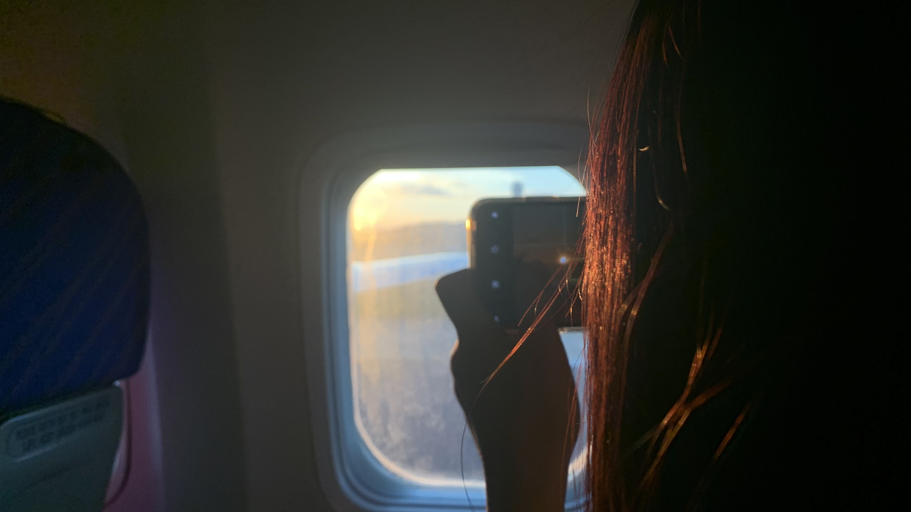
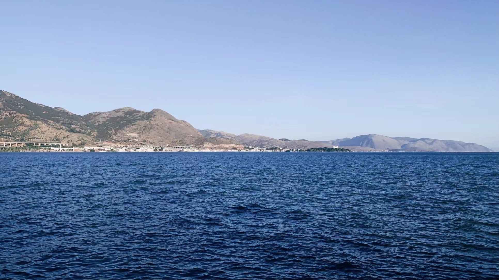
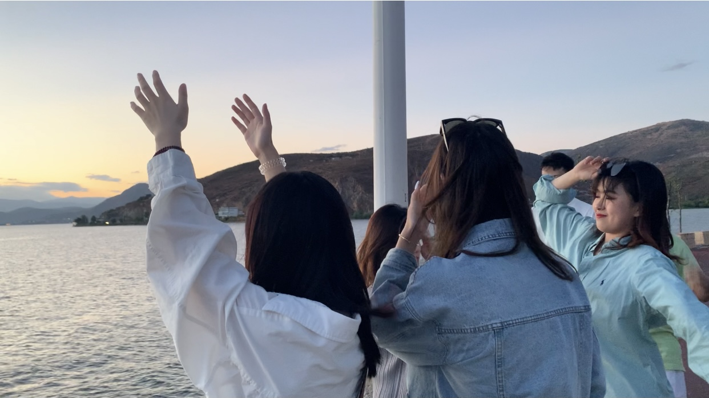
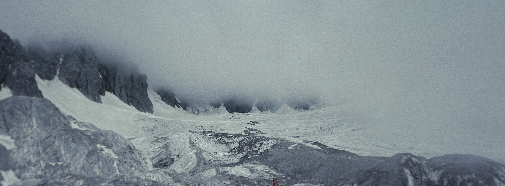


# 
# 
# 
# 
# 

gallery_item:
- album: <albums_yunnan>
  image: <1>.jpg
  caption: Arriving at Kunming Airport. Sunnet at 8 p.m.
- album: <albums_yunnan>
  image: <2>.jpg
  caption: Erhai Lake @ Dali.
